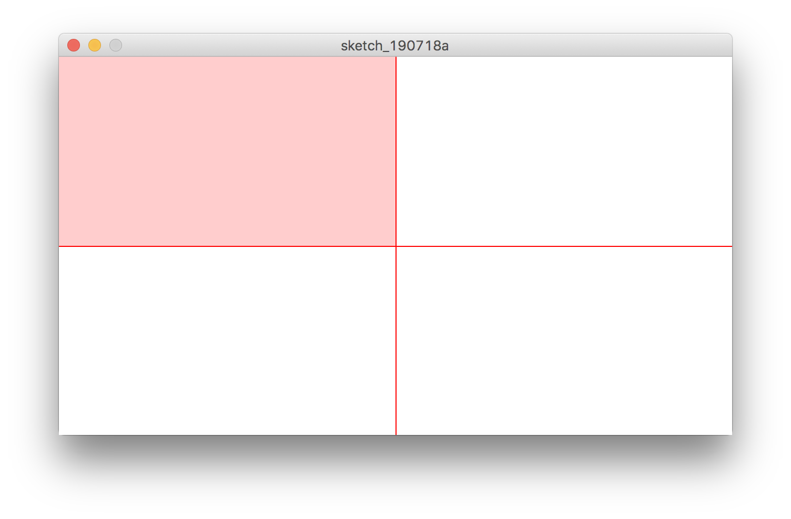

# Week 1 - Day 4

* **Comparison and logical operators** 
* Aug 1, 2019
* Status: in progress


## Summary
This module introduces comparison operators (e.g. `<`, `>`,`==`,`!=`) and logical operators (e.g. `&&`, `||`, `!`) through a series of hands-on Processing sketches.


## Operators

**Operators** are symbols that *operate* on values. In Processing syntax, operators are positioned between the values that they operate on (e.g. x **multiplied by** 5). *Operate on* can mean many things.

**Summary of Processing Operators** [(see Processing reference page)][1]

| Operator type  | Description | Symbols | Example use |
| -------------- | ----------- | :------:| ------- |
| Multiplicative | Multiply, divide, or find remainder of two values | `*`, `/`, `%` | `x * 5` <br> *x multiplied by five* |
| Additive       | Add or find the difference between two values | `+`, `-` | `x + 5` <br> *x plus five* |
| Relational     | Test whether one value is less than or greater than another | `<`, `>`, `<=`, `>=` | `x > 5` <br> *x is greater than 5* |
| Equality       | Test whether two values are either equal or not | `==`, `!=` | `x == 5` <br> *x is equal to 5* |
| Logical AND    | Combine multiple relational or equality tests with AND | `&&` | `x == 5 && y > 7` <br> *x is equal to five AND y is greater than seven* |
| Logical OR     | Combine multiple relational or equality tests with OR | `\|\|` | `x == 5 \|\| y > 7` <br> *Either x is equal to five OR y is greater than seven* |
| Assignment     | Assign value to variable | `=`, `+=`, `-=`, `*=`, `/=`, `%=` | `x = 5` <br> *Assign x the value of five* |

In this module, we will use *Relational*, *Equality*, *Logical AND*, *Logical OR*, and *Assignment operators*.

Keep reading:
* [Processing - Operator Precedence](https://processing.org/examples/operatorprecedence.html)
* [Processing - Logical Operators](https://processing.org/examples/logicaloperators.html)


## Quadrant exercise
In this exercise, we use quadrants (a hopefully familiar visual concept) to explore comparison and logical operators. Beginning with [Day 3's code][3], we add quadrant lines that will help guide us through these exercises:

```java
// Draw quadrant guidelines every frame after clearing background
stroke(255, 0, 0);                       // red stroke
line(width / 2, 0, width / 2, height);   // vertical line
line(0, height / 2, width, height / 2);  // horizontal line
stroke(0);                               // reset stroke
 ```
 
 
 
### Part 1: a simple walk-through

In yesterday's module, we created a sketch where a box follows the mouse. When the mouse is pressed, the box turns orange.
How might we modify that sketch so that when the mouse **is in the top left quadrant**, the box turns orange?

First, we can define the top left quadrant using *relational* and *logical operators*.
*    In English, we'd say "x is **less than** half the width **AND** y is **less than** half the height".
*    In Processing, we'd say `(x < width / 2) && (y < height / 2)`.



In our code, we want the box to change colors `if` the mouse's position is in the top left quadrant.
*    In English, we'd say "mouseX is **less than** half the width **AND** mouseY is **less than** half the height".
*    In Processing, we'd say `(mouseX < width / 2) && (mouseY < height / 2)`.

Adding these conditions to our existing code, we get:

```java
color c = color(255, 204, 0);

boolean colorActivated = (mouseX < width / 2) && (mouseY < height / 2);

if (colorActivated)
  {
    fill(c);
  } else
  {
   fill(0);
  } 
```

### Part 2: working through a more complex problem together

Relational and logical operators are powerful when used together. Using the same method as above, we can describe each of our quadrants (as well as every possible combination of quadrants!). For example: 

| Image | Condition |
| ----- | --------- |
|  | `(x > width / 2) && (y < height / 2)` |
|  | `(x > width / 2) && (y > height / 2)` |
|  | `x < width / 2` |
|  | `((x < width / 2) && (y < height / 2)) \|\| ((x > width / 2) && (y > height / 2))` |
|  | `!((x > width / 2) && (y < height / 2))` |

In this exercise, you will see a gif of a sketch that uses relational and logical operators to determine various visual elements on the canvas. Your task as a class is to reverse engineer the sketch using what we've learned together so far.

Suggested steps:

1)   Observe
2)   Describe
3)   Pseudocode
4)   Code


## Reflection
TODO(anna)


[1]: https://processing.org/examples/operatorprecedence.html
[2]: https://processing.org/examples/logicaloperators.html
[3]: https://github.com/mfadt-bootcamp-2019/code/blob/master/03_Conditions/day03_final_code/day03_final_code.pde
