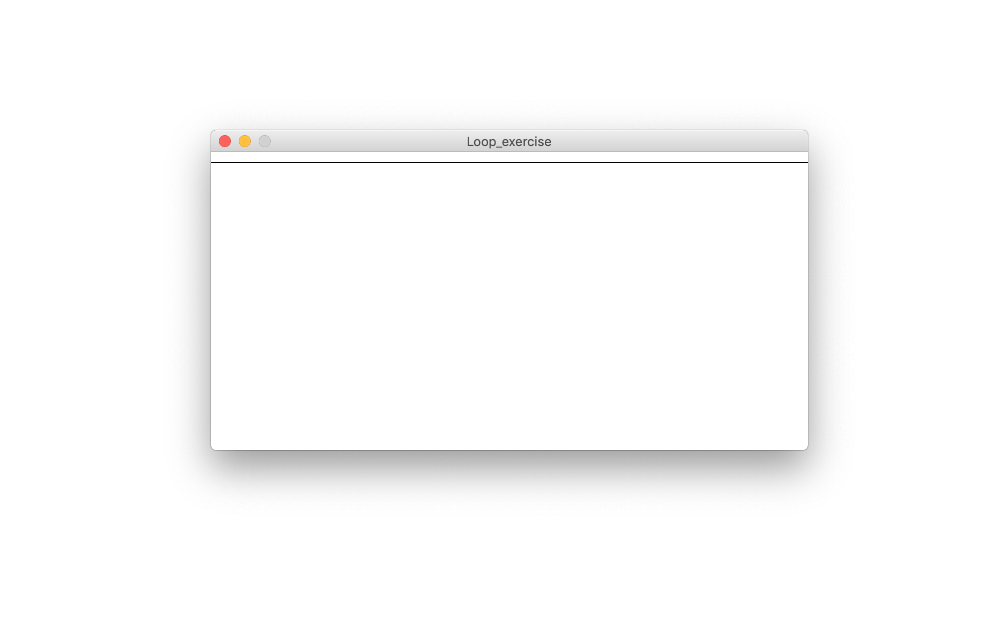
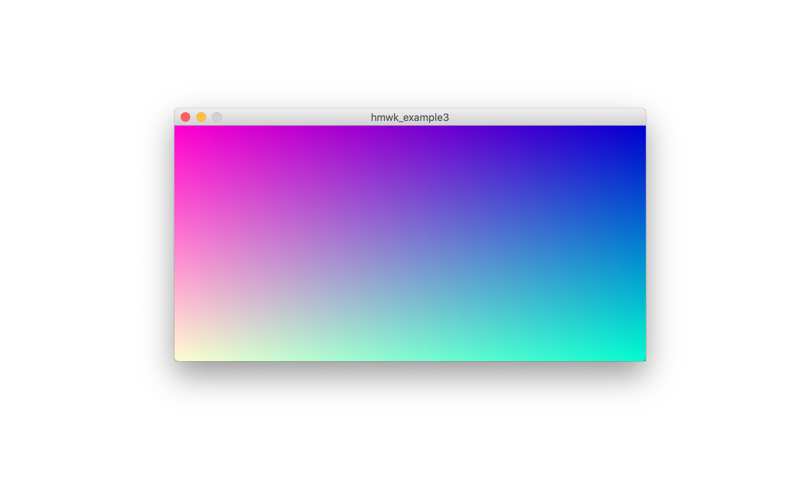

# Day 07, Functions & Loops

> Review Functions and Learn about for and while loops

#### What we will learn today:

- What is loop?
  - Controls a sequence of repetitions
- We will learn what While & For loops are through some physical activities.
  - Get up a move around!
  - Line drawing 1,2,3 ways!
  - What are operators?
    - ++, +=, -=...
- Now we will rewrite the activities in code on Processing
  
  
  
- Learn Map() Function

#### Homework

- We will create a full canvas of color gradient.
  - Try your way to recreate with any color of your choice.
  - Be creative! Try different ways of using loops.
    
    
    
