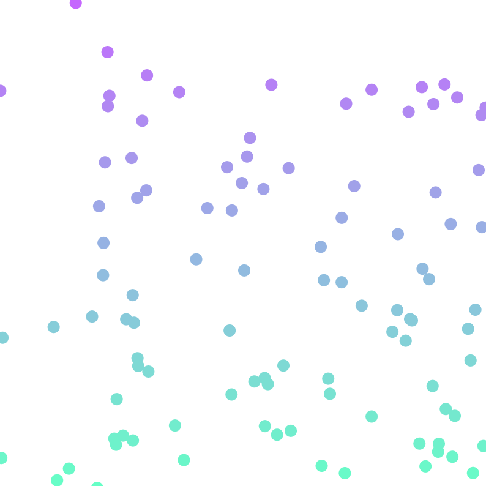

# Day 08, Arrays & Randomness

> Arrays and randomness

## Bouncing Balls

#### What we'll cover together

* Start with the code for a single [bouncing ball](ball_01)
* Now we're going to make 100 bouncing balls
	* Arrays!
* How can randomness make this more interesting?

#### What you can do on your own

* What else can you randomize in this sketch?
	* Color? Speed? Shape?
* How many balls can you add before the program crashes?
* Add gravity to the balls so they fall over time
* Can you do collision detection? We can't
	* Start by changing the sketch to use [Objects and Classes](https://processing.org/tutorials/objects/)

## Pattern Generation

#### What we'll cover together

* Let's look at some patterns :))))))))
	* [Anni Albers](https://www.google.com/search?q=anni+albers&source=lnms&tbm=isch)
* Pseudocode: how would we create something like this?
	* Pair psuedocode programming (one person draws pattern as dictated by another person)
* Livecoding one pattern together ([this beautiful one](https://nmwa.org/works/untitled-3))

#### What you can do on your own

* Change the colors!
* Add some additional shapes to each tile, or change from triangles to a different shape
* Make each tile smaller
	* Can you make it 100 by 100 instead of 8 by 8?
* Animate the tiles!
* Design your own textile pattern
	* Build a solo art career around this practice
