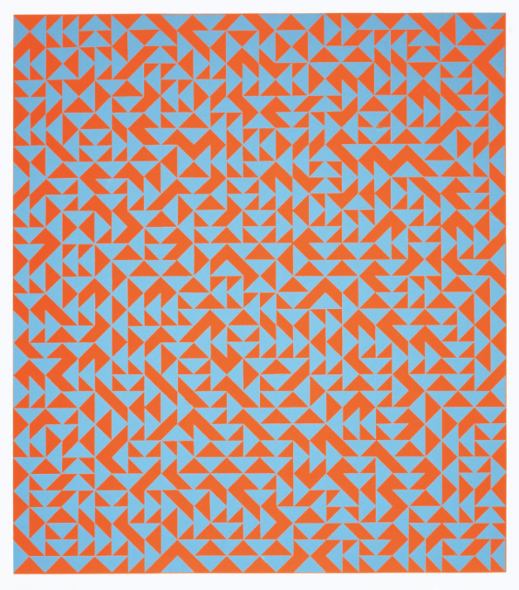
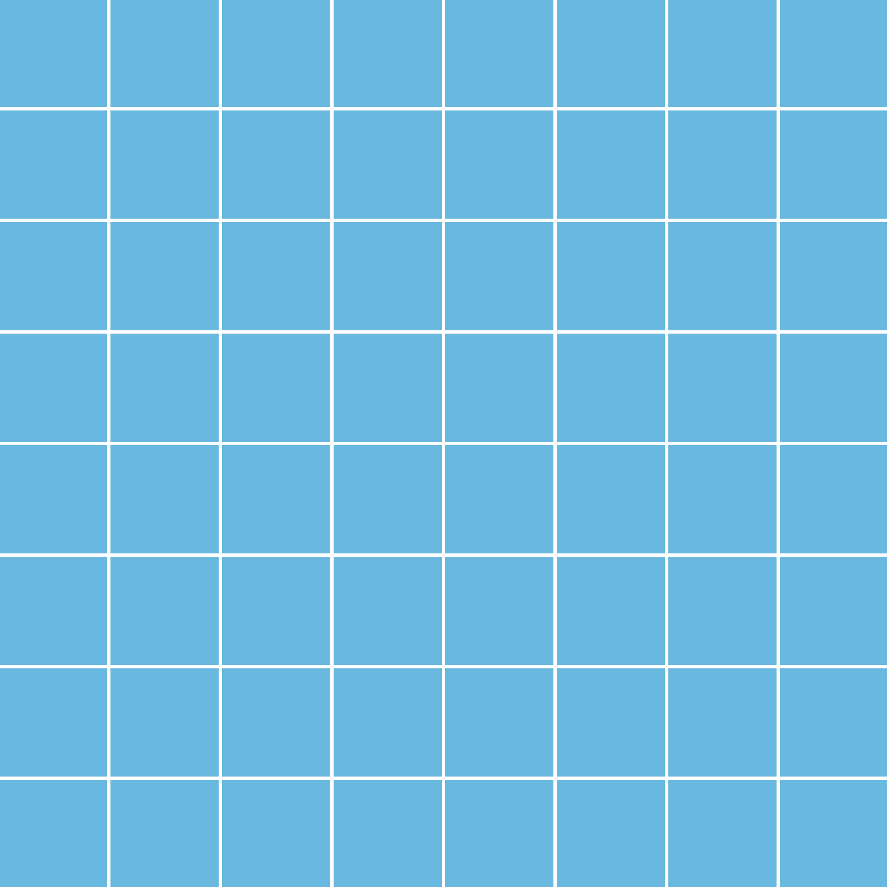
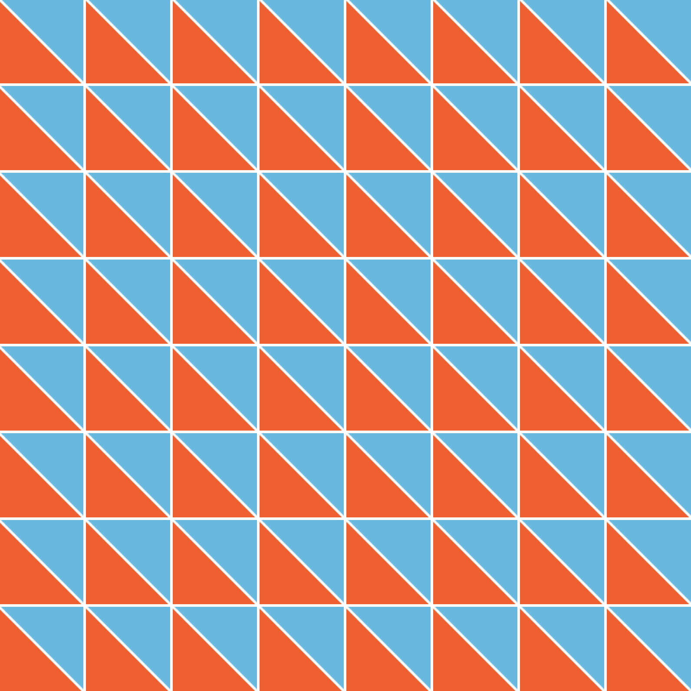
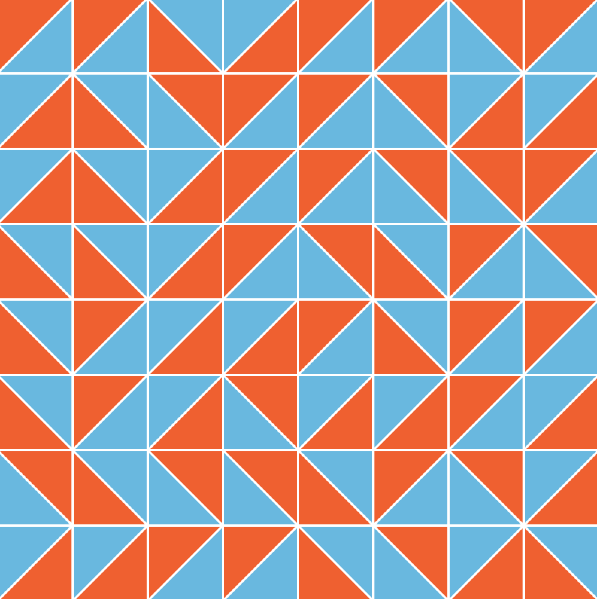
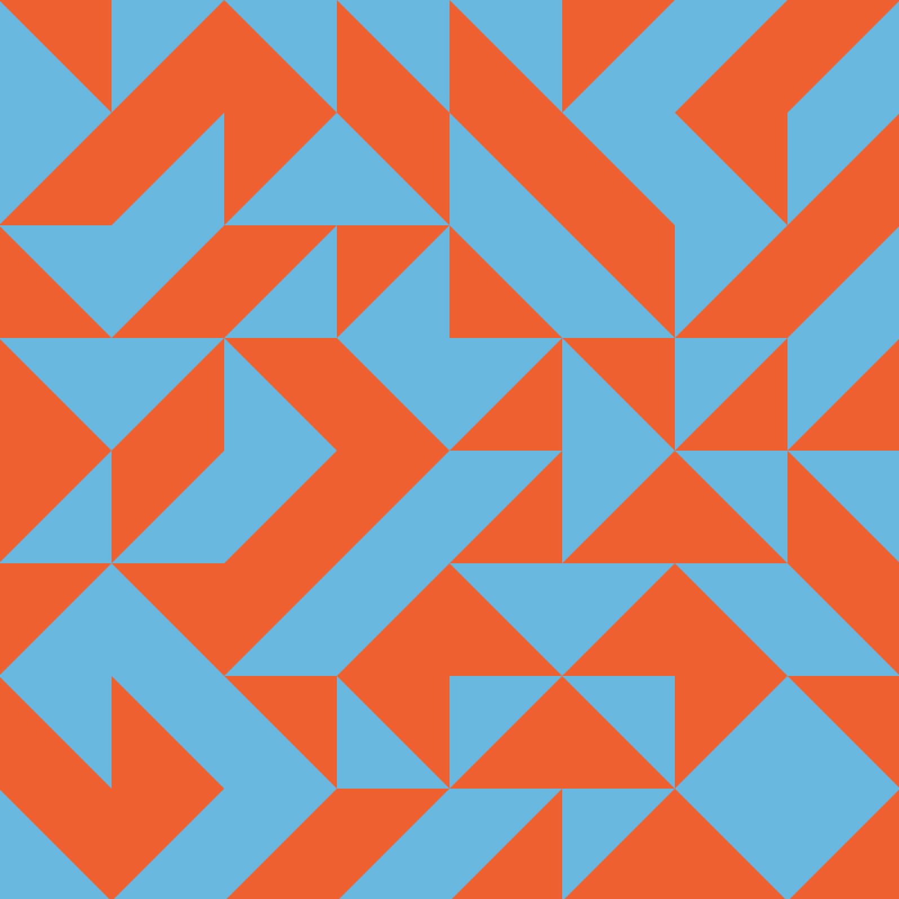

# Week 2 | Day 09

> Randomness, loops, and arrays (continued)

## Summary

This module continues our focus on randomness, loops, and arrays. Using these tools, we will recreate an [Anni Albers' painting](https://nmwa.org/works/untitled-3) together. In addition to the tools we learned yesterday, we'll think about higher-level processes like observing, strategizing, and breaking a large task into smaller tasks.

The classtime will include:

* Small group work (pencil and paper) - 45 min
* Group coding (Processing) - 45 min
* Individual challenges (Processing) - 30 min

## Small group work (pencil and paper)

In pairs or small groups, take time to look at this Albers painting in detail.

*Anni Albers, "Untitled", 1969*

1) **Describe** the painting. Note elements like shapes, colors, grids, or systems. Be as precise as possible. If you were going to instruct a classmate how to draw this, how would you instruct them?

> Note to Bootcamp TFs: we might even consider breaking the class into two at the start, and have one student (who has seen the pattern) to instruct another student (who hasn't seen the pattern) how to draw it.

2) **How might you begin to code this?** What familiar tools (e.g. variables, loops, arrays, etc.) might you use? What else might you need to know? Use language, sketching, or pseudocode to put these ideas on paper.

## Group coding (Processing)

There are many ways we could code this. Together we will write the code in five steps.

| Step | Image | Description |
| ---- | ----- | ----------- |
| 1 |  | Make a blue background |
| 2 |  | Add X-Y grid-lines for guidance |
| 3 |  | In each grid location, add an orange triangle |
| 4 |  | Randomly rotate each triangle |
| 5 |  | Remove the X-Y grid-lines |

## Individual challenges (Processing)

**Challenge set 1**
1) Modify the sketch to be 30x34 triangles rather than 10x10.
1) How about 100x100?
1) Change the colors from blue and orange to two different colors.

**Challenge set 2**
1) Write an alternative method for producing the same class sketch. For example, consider using the rotate() function.
1) For each grid position, add the option to drop an orange square instead of just triangles.
1) Change the triangles / squares into randomly sized circles.
1) Animate the pattern so that it changes every second.

**Challenge set 3**
1) Using arrays, loops, and randomness, recreate a new pattern by Anni Albers or another inspiration. 
1) For an extra challenge, consider using noise() rather than random(). What changes?
